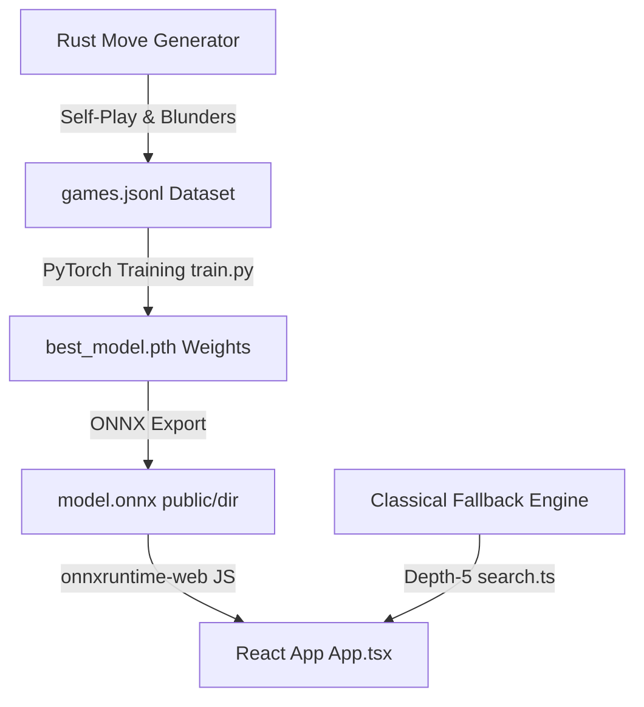

# Double Move Chess: Hybrid AI Engine & Web Client

Double Move Chess is a unique chess variant where each player makes **two moves in a single turn**. 
This project features a hybrid development pipeline: a high-performance **Rust Move Engine**, a **PyTorch Reinforcement Learning Training Suite**, and a gorgeous, responsive **React + Vite Web Client** powered by client-side **ONNX model inference**.

---

## 🎮 Double Move Chess Rules

1. **Double Moves**: White starts by making two consecutive moves. Then Black makes two consecutive moves, and so on.
2. **Immediate Check Checkpoint**: If a player's first move delivers a check, their turn ends *immediately* (they do not get a second move).
3. **Check Resolution**: A player cannot end their turn with their King in check. If they are in check at the start of their turn, they must escape the check on or before their second move.
4. **No King Capture**: You cannot capture the opponent's king. Checkmate is achieved when the opponent cannot escape check within their two moves.

---

## ⚙️ Architecture Pipeline



---

## 🛠️ Project Components

### 1. Rust Move & Search Engine (`/src`)
- **`board.rs` & `moves.rs`**: Core board state management and double-move legal move generator.
- **`search.rs`**: Heuristic evaluation using Piece-Square Tables (PSTs) and deep Alpha-Beta search.
- **`data.rs`**: Self-play generator that creates high-quality training datasets. It injects **Blunder Counter-Factuals** (exploring alternate worse moves) into the history to ensure the neural network learns to recognize and score poor positions.
- **`gui.rs`**: Interactive native desktop GUI for debugging matches.

### 2. PyTorch Neural Network (`train.py`)
- Value network architecture trained on generated self-play logs.
- Outputs positional evaluation scores mapped to win/loss probabilities.
- Compiles the best checkpoint to `model.onnx` for browser compatibility.

### 3. React Web Application (`/web`)
A highly polished, dark-themed frontend built with React, Vite, and TypeScript.
- **AI Play Modes**: Play vs the AI (either using the **🧠 Neural Network** via WebAssembly WASM, or the **🧮 Pure Classical Heuristics** fallback engine).
- **Rich Visuals**: Interactive Chessboard with target move dots, move paths, check highlights, and custom responsive scaling.
- **Saved Games Database**: Locally persist your matches using IndexedDB/localStorage.
- **Instant Analysis Flow**: 
  - Clicking a game loads it instantly at the starting position (zero UI blocking/freezes).
  - Jumps or steps through plies using a manual slider/stepper or click-to-navigate Move Log.
  - Generates detailed evaluations (Blunder, Mistake, Good, Great, Neutral badges) and best-move recommendations on demand when clicking **Begin Analysis**.
- **GitHub Pages Portable**: Compiled with relative base routing so the app can be uploaded and deployed instantly to any domain subfolder.

---

## 🚀 Getting Started

### Prerequisites
- **Rust** (MSRV 1.70+)
- **Python 3.8+** with PyTorch
- **Node.js** (v18+) & **npm**

---

### Running the Rust Engine & Data Generation
1. Compile the Rust engine:
   ```bash
   cargo build --release
   ```
2. Generate self-play training games:
   ```bash
   cargo run --release -- --mode data
   ```

### Training the Model
1. Install Python dependencies:
   ```bash
   pip install torch onnx
   ```
2. Train the value network and export the ONNX model:
   ```bash
   python train.py
   ```
3. Copy the resulting `model.onnx` file into the React project's public folder:
   ```bash
   cp model.onnx web/public/
   ```

### Running the React Web Client
1. Navigate into the web folder:
   ```bash
   cd web
   ```
2. Install dependencies:
   ```bash
   npm install
   ```
3. Start the local development server:
   ```bash
   npm run dev
   ```
4. Build for production (GitHub Pages ready):
   ```bash
   npm run build
   ```
   The compiled static files will be placed in `web/dist`.

---

## 📄 License
This project is licensed under the MIT License.
